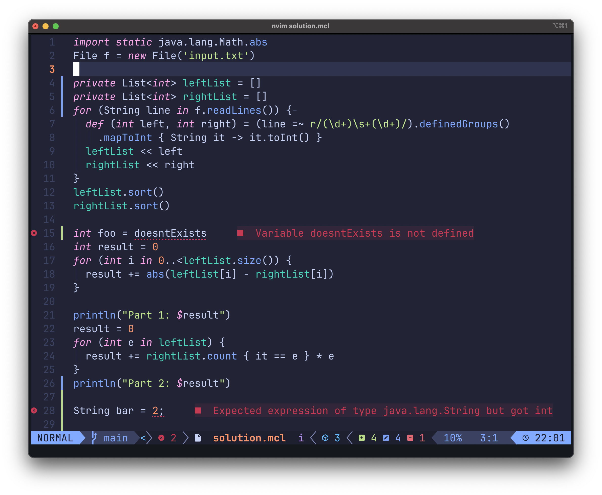

# Marcel Language Server

A Language Server Protocol (LSP) implementation for the [**Marcel**](https://tambapps.github.io/marcel/) programming language, built using [LSP4J](https://github.com/eclipse/lsp4j).

This server enables smart code features in any editor that supports LSP (like Neovim, VSCode, etc.) when editing Marcel files.

## ✨ Features

- **Intelligent auto-completion** (`textDocument/completion`)
- **Semantic highlighting** (`textDocument/semanticTokens/full`)
- **Syntax and semantic diagnostics** (`textDocument/publishDiagnostics`)
- **Go to definition** (coming soon)
<!-- - **Hover information** (coming soon) -->

## Neovim

Here is a screenshot of the Marcel LSP server configured with NeoVim

